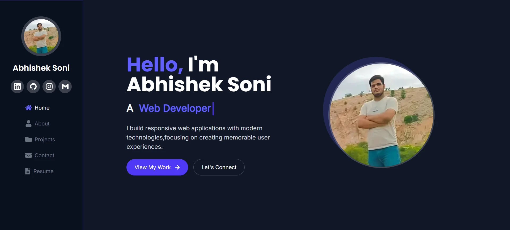
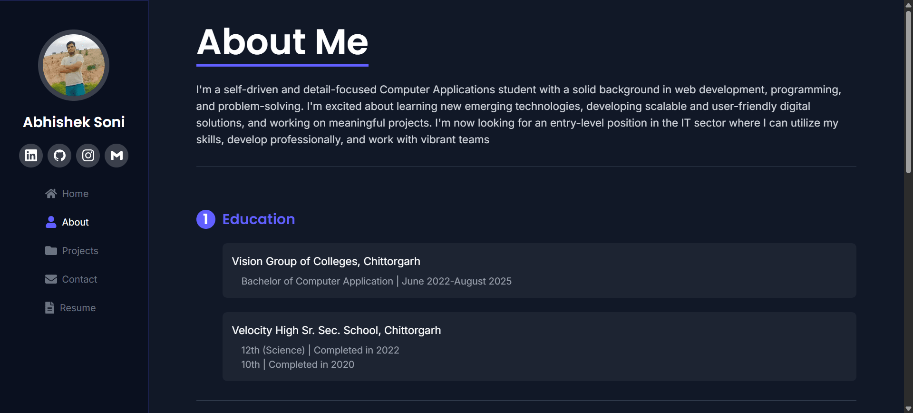
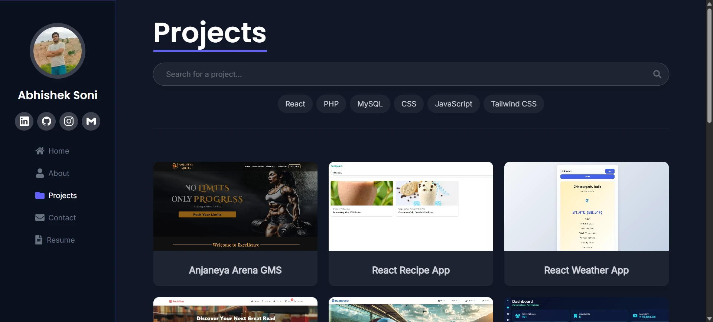
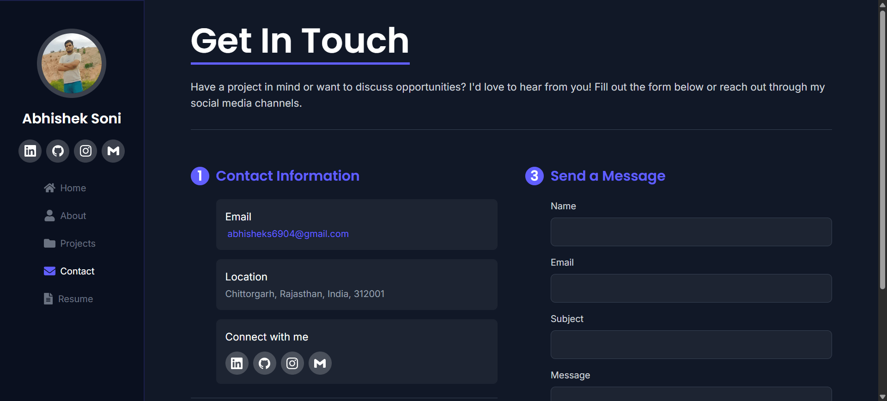

# Abhishek Soni's Portfolio

A modern, responsive developer portfolio built with **React**, **Vite**, and **Tailwind CSS**. Showcases projects, skills, and contact information with a clean UI and smooth navigation.

## Features

- ⚡ **Fast**: Powered by Vite for instant reloads and builds.
- 🎨 **Modern UI**: Styled with Tailwind CSS and custom components.
- 🗂️ **Projects Showcase**: Filter and search through a list of projects.
- 🏷️ **Skills Section**: Interactive skill badges with descriptions.
- 📱 **Responsive**: Works on all devices.
- 🌐 **Social Links**: Quick access to LinkedIn, GitHub, Instagram, and Email.
- 📄 **Resume Download**: Downloadable resume link.
- ✉️ **Contact Form**: Send messages directly via FormSubmit.

## Performance Scores

- **Desktop:**
  - Performance: 99
  - Accessibility: 96
  - Best Practices: 96
  - SEO: 100

- **Mobile:**
  - Performance: 95
  - Accessibility: 100
  - Best Practices: 96
  - SEO: 100

These scores reflect the website's optimization and performance across both desktop and mobile devices.

## Demo

[Live Demo](https://abhishek-soni6904.github.io/Abhishek-Portfolio)

## Screenshots

| Home                                         | About                                        |
|---------------------------------------------|----------------------------------------------|
|    |   |

| Projects                                     | Contact                                      |
|---------------------------------------------|----------------------------------------------|
|  |  |

## Customization

- **Projects:**  
  Edit `src/assets/projectsData.js` to add, remove, or update your projects. Images should be placed in `src/assets/projectImages/`.

- **Skills:**  
  Update the badges array in `src/components/SkillBadges.jsx` to reflect your skills.

- **Social Links:**  
  Edit the `SocialLinks` array in `src/components/SocialIcons.jsx`.

- **Resume:**  
  Replace `public/resume.pdf` with your own resume file.

- **Profile Image:**  
  Replace `src/assets/image.webp` with your own profile picture.

## Technologies Used

- [React](https://react.dev/)
- [Vite](https://vitejs.dev/)
- [Tailwind CSS](https://tailwindcss.com/)
- [React Router](https://reactrouter.com/)
- [React Icons](https://react-icons.github.io/react-icons/)
- [FormSubmit](https://formsubmit.co/) (for contact form)

---

## Contact📩  
For any queries or support, feel free to reach out:
- **👤 Name**: Abhishek Soni
- **📧 Email**: abhisheks6904@gmail.com
- **🔗 GitHub**: [Abhishek-soni6904](https://github.com/Abhishek-soni6904)
- **📸 Instagram**: [\_abhishek.\_\.soni\_](https://www.instagram.com/_abhishek._.soni_/)
- **💼 LinkedIn**: [Abhishek Soni](https://www.linkedin.com/in/abhishek-soni-662028331/)